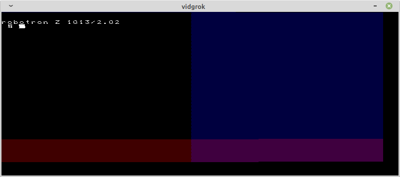
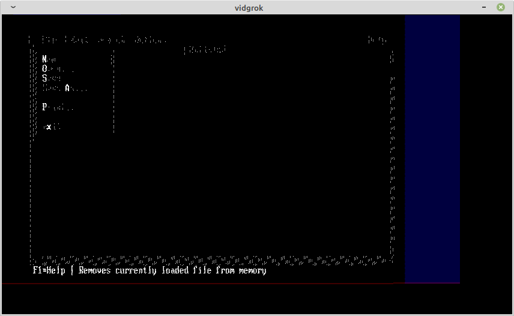
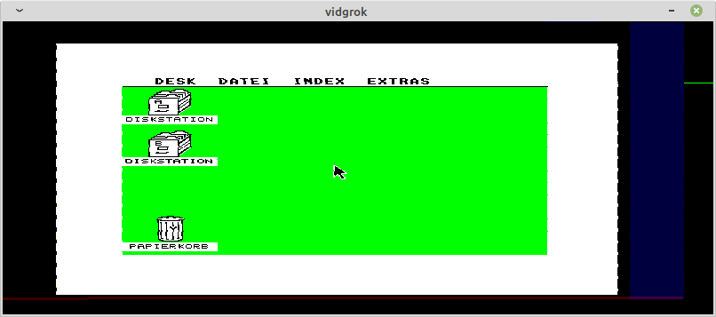
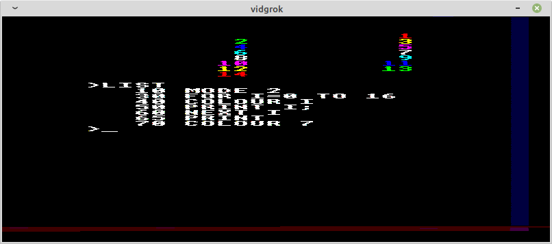
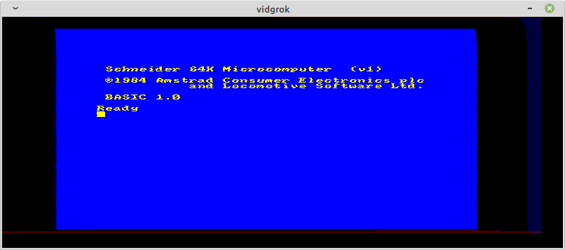

# vidgrok

vidgrok is a tool for realtime visualization of video data captured by low-cost logic analyzers. Its main intent is to display raw video signals of historic home computers. vidgrok uses [libsigrok](https://sigrok.org/)
 for capturing and [SDL2](https://www.libsdl.org/) for rendering.

## Installation / Building

```
# Install required dependencies (on Debian)
apt-get update
apt-get install -y meson libsigrokcxx-dev libglibmm-2.4-dev libsdl2-dev libcxxopts-dev g++

# Build and install
meson setup build
cd build
meson compile
meson install
```

Instead of installing the build tools and dependencies directly, it's also possible to use the `build_in_container.sh` script. It will create a Docker container with the above dependencies/build tools, mount the project directory and run the build commands.

## Usage

For displaying a video signal, [the logic analyzer](https://sigrok.org/wiki/Supported_hardware) needs to be connected to these signals:

- Ground
- Vertical sync (Default: Channel 0)
- Horizontal sync (Default: Channel 1)
- Pixel data (Default: Channel 2)

When calling without arguments, the following defaults are assumed:

```
vidgrok --sample-rate 12000000 --vsync 0 --hsync 1 --data 2 --width 800 --height 330
```

When RGB output is available `--data 234` and can be used to achieve colored rendering (in this example Red: Channel 2, Green: Channel 3, Blue: Channel 4).

The detailed list of possible command line arguments can be obtained by

```
vidgrok --help
```

## Examples

### Robotron Z 1013

The video signal of Robotron Z 1013 can be captured with a sample rate of 12 MHz by directly connecting to the logic ICs like this:

- Ground: e.g. modulator enclosoure
- VSync: A6 Pin 12
- HSync: A9 Pin 11
- Data: A32 Pin 12

Calling vidgrok with these arguments produces the output below.

```
vidgrok --sample-rate 12000000 --vsync 0 --hsync 1 --data 2 --invert-data --highlight-vsync --highlight-hsync --width 800 --height 330
```



The blue area corresponds to the horizontal and the red area to the vertical blanking intervals.

### VGA (old 386 laptop)

A really bad image can be obtained from VGA resolution output (640x480) with a sample rate of 24 MHz when directly connecting to the 15-pin D-sub connector:

- Ground: Pin 6
- VSync: Pin 14
- HSync: Pin 13
- Data: Pin 1 (Red)
 
```
vidgrok --sample-rate 24000000 --vsync 0 --hsync 1 --data 2 --invert-vsync --highlight-vsync --highlight-hsync --width 850 --height 500
```

Since the color/intensity data is an analog signal, only the bright pixels trigger the threshold for the input channel. The screenshot shows the MS DOS Editor.



### Atari 1040 STF

The [Atari ST's digital RGB video output](https://info-coach.fr/atari/hardware/interfaces.php#atari_video_connector) works with 8 colors (3 bit) and 12 MHz sample rate.

- Ground: Pin 13
- VSync: Pin 12
- HSync: Pin 9
- Red: Pin 7
- Green: Pin 6
- Blue: Pin 10


```
vidgrok --sample-rate 12000000 --vsync 0 --hsync 1 --data 234 --highlight-vsync --highlight-hsync --width 800 --height 330
```



### Acorn Electron or Amstrad CPC 464 (using LM1881)

The composite sync output of the Acorn Electron can be separated in horizontal and vertical sync pulses using the LM1881.

Pinout of the 6-pin DIN connector:

- Red: Pin 1
- Green: Pin 2
- Blue: Pin 3
- (Composite) Sync: Pin 4
- Ground: Pin 5
- +5 V: Pin 6

The red, green and blue signals can go directly to the logic analyzer.

The LM1881 should be wired as described in the datasheet ("Typical Connection Diagram"): A capacitor (0.1µF) and resistor (680 kOhms) in parallel from Pin 6 to Ground. Composite Sync goes via a 0.1µF capacitor to Pin 2. VSync will be available on Pin 3 and HSync on Pin 5. The +5 V from the Electron can be used to power the LM1881 (Pin 8). Ground goes to Pin 4.

```
vidgrok --sample-rate 12000000 --vsync 0 --hsync 1 --data 234 --highlight-hsync --highlight-vsync --width 800 --height 330
```



Amstrad CPC 464 works in the same way, except that it does not provide +5 V output.



This circuit will probably work for other computers providing RGB output and a composite sync signal.

## Authors

Stefan Schramm (<mail@stefanschramm.net>)

## License

[GPLv3](https://www.gnu.org/licenses/gpl-3.0)
